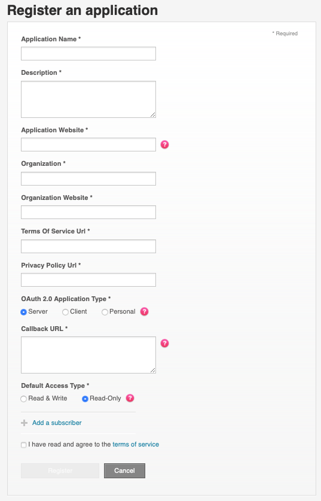

# fitbitter_example

A simple app that demonstrates the use of fitbitter.

## Instructions

To run the example application follow these steps.

* Create a Fitbit account, if you do not have one.
* Register a new app at [https://dev.fitbit.com/apps/new](https://dev.fitbit.com/apps/new).
  The form will look like this: 
  
  
* Choose an "Application Name" (e.g., "Example").
* Set a brief "Description" (e.g., "Just a simple test of an awesome package.")
* Set the "Application Website". It can be random for the purpose of testing the example so let's put https://www.example.com/.
* Set an "Organization" (e.g., "Myself").
* Set an "Organization Website". It can be random for the purpose of testing the example so let's put https://www.myself.com/.
* Set a "Terms of Service Url". It can be random for the purpose of testing the example so let's put https://www.myself.com/tos.
* Set an "Privacy Policy Url". It can be random for the purpose of testing the example so let's put https://www.myself.com/pp.
* Set the "Application Type" to "Client".
* Choose a Callback URL" (e.g., "example://fitbit/auth").
* Choose a "Default Access Type" (e.g., "Read-Only").
* Check the "I have read and agree to the terms of service" box.
* Click the "Register" button. You should now see the "OAuth 2.0 Client ID" and the "Client Secret" strings provided by Fitbit.
* Go to "lib/utils/strings.dart" and change the values of the following variables 
```dart
// Fitbit Client ID
static const String fitbitClientID = 'XXX';
// Fitbit Client Secret
static const String fitbitClientSecret = 'XXX';
  ```
from 'XXX' to the "OAuth 2.0 Client ID" and "Client Secret" strings values provided at the previous step.
Then change the values of the following variables:
```dart
/// Auth Uri
static const String fitbitRedirectUri = 'XXX';
/// Callback scheme
static const String fitbitCallbackScheme = 'XXX';
```
from 'XXX' to 'example://fitbit/auth' and 'example', respectively.
* (To run the example on Android) Go to android/app/src/main/AndroidManifest.xml, locate the following snippet of code
```xml
<activity android:name="com.linusu.flutter_web_auth_2.CallbackActivity"
          android:exported="true">
            <intent-filter android:label="flutter_web_auth">
              <action android:name="android.intent.action.VIEW" />
              <category android:name="android.intent.category.DEFAULT" />
              <category android:name="android.intent.category.BROWSABLE" />
              <data
                android:scheme=YOUR_CALLBACK_SCHEME
                android:host="fitbit-auth"/>
            </intent-filter>
        </activity>
```
and change ```YOUR_CALLBACK_SCHEME``` with your callback scheme (in this example ```example```)

* (To run the example on Android) Increase the minimum Android SDK version. Open `android/app/build.gradle`, locate this snippet of code:
```
...
defaultConfig {
        applicationId "your.app.id"
        minSdkVersion flutter.minSdkVersion
        targetSdkVersion flutter.targetSdkVersion
        versionCode flutterVersionCode.toInteger()
        versionName flutterVersionName
    }
...
```
and change ```minSdkVersion``` to 18 or above, e.g.,:
```
...
defaultConfig {
        applicationId "your.app.id"
        minSdkVersion 18
        targetSdkVersion flutter.targetSdkVersion
        versionCode flutterVersionCode.toInteger()
        versionName flutterVersionName
    }
...
```

* Requirement: Web Browser. Fitbitter uses `flutter_web_auth` to let you authenticate to Fitbit. In order to let it work correcty please be sure that your emulator or your physical device is using Chrome, Opera, or Firefox as default web browser. 

* Run the application with `flutter run`. Enjoy!
  
